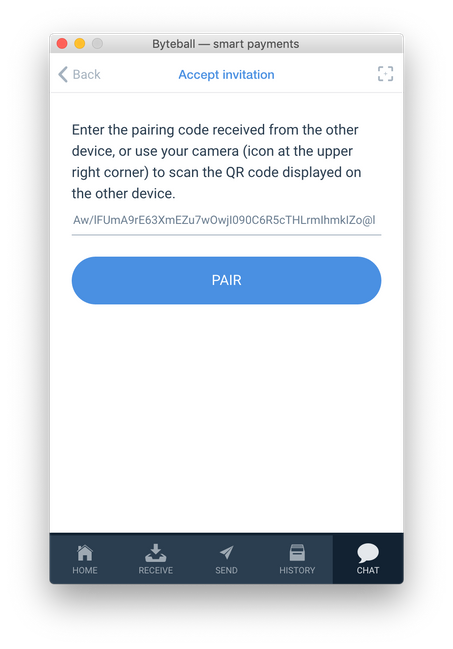

# Ping-pong paymets

Hello. I’m starting a series of tutorials about creating projects on Obyte. Today we will consider the creation of ping-pong payment bot. First we will need Linux or MacOS, node.js, [Obyte wallet for testnet](https://byteball.org/testnet.html) and [bot-example](https://github.com/byteball/bot-example). So, let's clone it and run

```bash
git clone https://github.com/byteball/bot-example
cd bot-example 
npm install
cp .env.testnet .env
node start.js
```

\
We run `cp .env.testnet .env` for changing it configuration to testnet network. When you starting bot at first, he will ask you passphrase(don’t forget it, since you need to enter each time you start). When starting bot in console you will see “my pairing code”. It looks like this: Copy this pairing code.


Now add our bot, open the Obyte wallet and go to Chat (below) > Add a new device > Accept invitation from the other device then insert your pairing code (instead of an asterisk any word, for example, test) and click "PAIR”



After that you will have a chat with your bot, write to him and he will answer you with your message. All right, now let's teach the bot to give us our money back.

Opening the start.js file we see 5 events:

**headless\_wallet\_ready** - Triggered when the bot is running and ready to work

**paired** - Triggered when someone adds our bot

**text** - Triggered when we receive a message

**new\_my\_transactions** - Triggered when we receive a transaction(but it is not stable)

**my\_transactions\_became\_stable** - Triggered when the transaction has become stable

First, let's create variables where the associations for addresses will be stored. We will learn how to work with the database in the following lessons.

```javascript
let assocDeviceAddressToPeerAddress = {};
let assocDeviceAddressToMyAddress = {};
let assocMyAddressToDeviceAddress = {};
```

\
Now, lets teach the bot to send a request to send us your address:

```javascript
eventBus.on('paired', (from_address, pairing_secret) => {
  const device = require('ocore/device.js');
  device.sendMessageToDevice(from_address, 'text', "Please send me your address");
});

eventBus.on('text', (from_address, text) => {
  text = text.trim();

  const device = require('ocore/device.js');
  device.sendMessageToDevice(from_address, 'text', "Please send me your address");
});
```

Here we see the function **sendMessageToDevice**, we will use it whenever we want to send a message to the user.

The function takes 3 parameters

1. device address
2. subject - for now we will use only ‘text’
3. our text message

In order to send bot our address we need to go to our chat and click "Insert my address”:

.png>)

Great, now we will teach our bot to check and save the user's address, and also create an address for accepting payments and request 5000 bytes from the user.

```javascript
eventBus.on('text', (from_address, text) => {
  const device = require('ocore/device.js');
  text = text.trim();
  if (validationUtils.isValidAddress(text)) {
     assocDeviceAddressToPeerAddress[from_address] = text;
     device.sendMessageToDevice(from_address, 'text', 'Saved your wallet address');
     headlessWallet.issueNextMainAddress((address) => {
        assocMyAddressToDeviceAddress[address] = from_address;
        assocDeviceAddressToMyAddress[from_address] = address;
        device.sendMessageToDevice(from_address, 'text', '[balance](byteball:' + address + '?amount=5000)');
     })
  } else if (assocDeviceAddressToMyAddress[from_address]) {
     device.sendMessageToDevice(from_address, 'text', '[balance](byteball:' + assocDeviceAddressToMyAddress[from_address] + '?amount=5000)');
  } else {
     device.sendMessageToDevice(from_address, 'text', "Please send me your address");
  }
});
```

This time we used **issueNextMainAddress**, this function creates a new wallet address. We need it to distinguish between payments.

Now the most important thing! First, we need to inform the user that we have received the payment and waiting until it becomes stable.

```javascript
eventBus.on('new_my_transactions', (arrUnits) => {
  const device = require('ocore/device.js');
  db.query("SELECT address, amount, asset FROM outputs WHERE unit IN (?)", [arrUnits], rows => {
     rows.forEach(row => {
        let deviceAddress = assocMyAddressToDeviceAddress[row.address];
        if (row.asset === null && deviceAddress) {
           device.sendMessageToDevice(deviceAddress, 'text', 'I received your payment: ' + row.amount + ' bytes');
           return true;
        }
     })
  });
});
```

After that, we send the user his payment minus the payment fee:

```javascript
eventBus.on('my_transactions_became_stable', (arrUnits) => {
  const device = require('ocore/device.js');
  db.query("SELECT address, amount, asset FROM outputs WHERE unit IN (?)", [arrUnits], rows => {
     rows.forEach(row => {
        let deviceAddress = assocMyAddressToDeviceAddress[row.address];
        if (row.asset === null && deviceAddress) {
           headlessWallet.sendAllBytesFromAddress(row.address, assocDeviceAddressToPeerAddress[deviceAddress], deviceAddress, (err, unit) => {
              if(err) device.sendMessageToDevice(deviceAddress, 'text', 'Oops, there\'s been a mistake. : ' + err);

              device.sendMessageToDevice(deviceAddress, 'text', 'I sent back your payment! Unit: ' + unit);
              return true;
           })
        }
     })
  });
});
```

\
\
Here, we use **sendAllBytesFromAddress**, as the name implies, we just send all the funds(minus the payment fee) from one address to another.

That's it. Now let's test it. To do this you need to add faucet bot: AxBxXDnPOzE/AxLHmidAjwLPFtQ6dK3k70zM0yKVeDzC@byteball.org/bb-test#0000

And send him your address, wait until it becomes stable(this can be seen on the main screen), that's all. Send payments to the bot and get them back.

.png>)

All code you can find on [github](https://github.com/xJeneKx/Tutorial-1). In the next lessons we will continue, but for now I recommend to read the official [wiki](https://github.com/byteball/byteballcore/wiki/Byteball-Developer-Guides). Did you like the lesson? Any questions? What topics have caused you difficulties and it is worth talking about them? Write in the comments and I will help you. Also, join my chat in telegram - [@obytedev](https://t.me/devbyteball).
